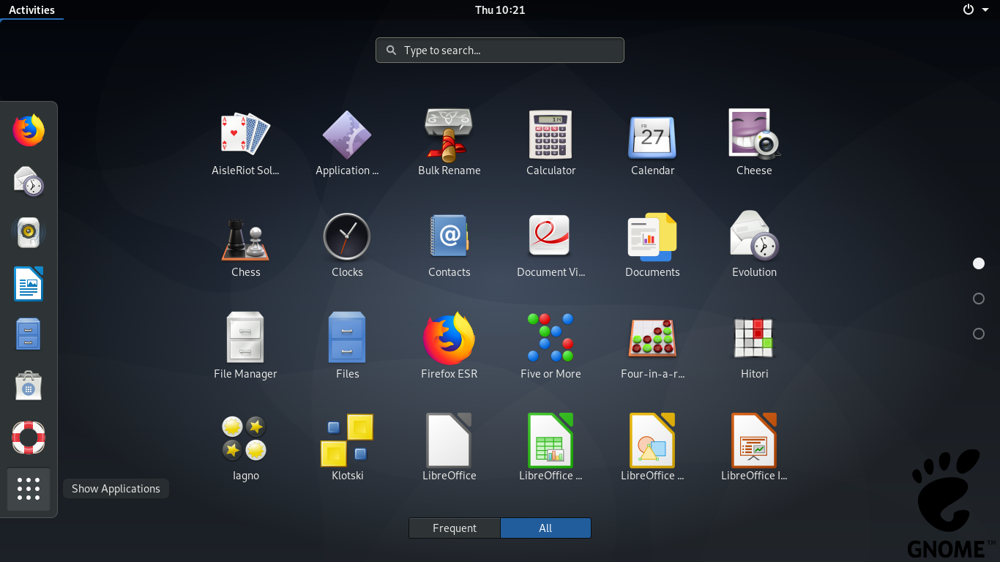
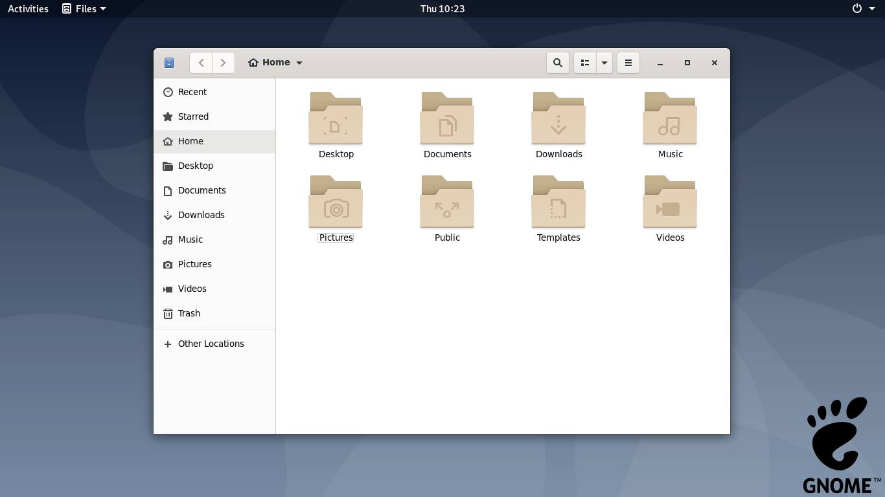

# Gnome Installer for Linux

For original version:

#cd Linux

#bash Gnome-Installer-For-(your linux based).sh

Reboot your system.

Change your desktop environment to GNOME (every linux are different ways).

For WSL version:

#cd Linux

#bash Gnome-Installer-For-(your linux based).sh

#sudo service dbus restart

#DISPLAY=0:0 XDG_SESSION_TYPE=x11 gnome-session

Open your xlaunch again.

Enjoy.

