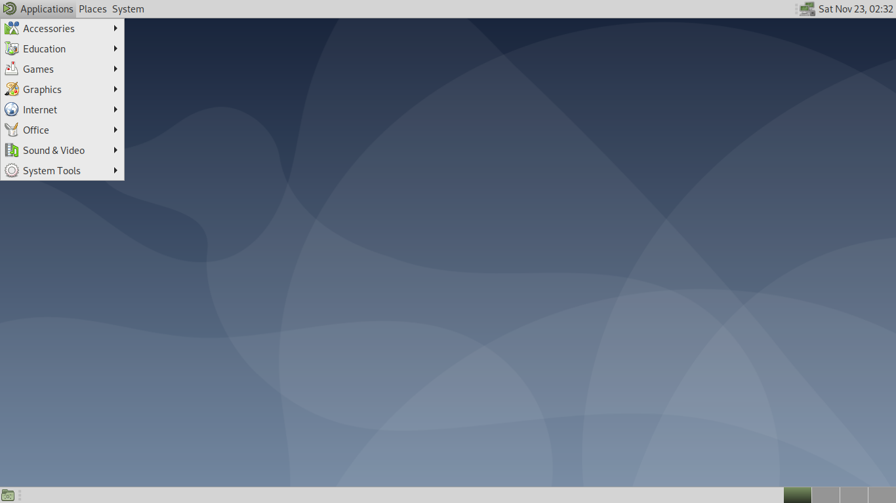
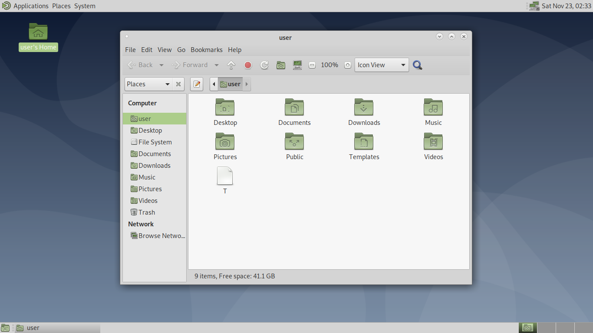

# MATE Installer for Linux

For original version:

#cd Linux

#bash MATE-Installer-For-(your linux based).sh

Reboot your system.

Change your desktop environment to MATE (every linux are different ways).

For WSL version:

#cd Linux

#bash MATE-Installer-For-Linux-Based-On-Debian.sh

#startlxde

Open your xlaunch again.

Enjoy.

