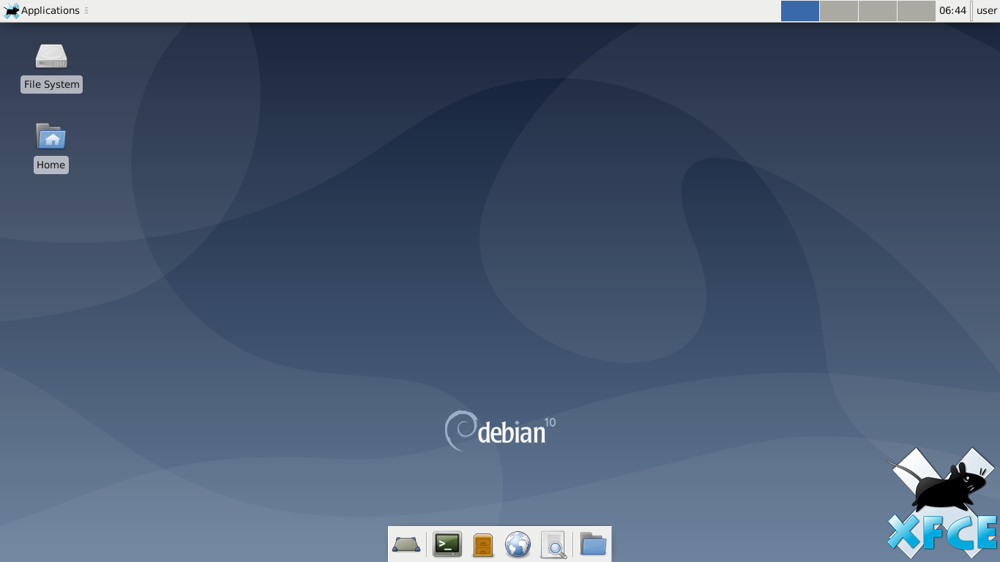
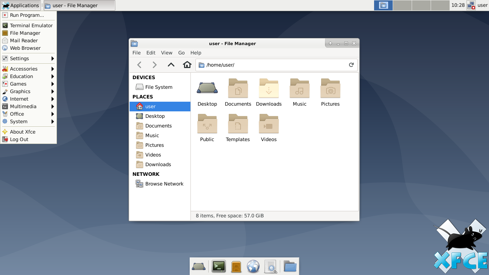

# Xfce Installer for Linux

For original version:

#cd Linux

#bash Xfce-Installer-For-(your linux based).sh

Reboot your system.

Change your desktop environment to xfce4-session (every linux are different ways).

For WSL version:

#cd Linux

#bash Xfce-Installer-For-(your linux based).sh

#xfce4-session

Open your xlaunch again.

Enjoy.

